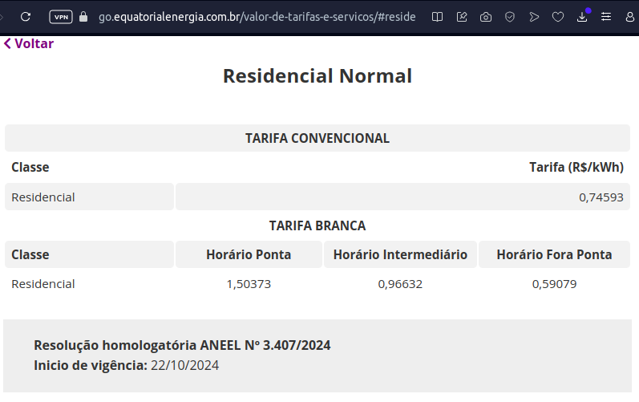

## Estimativa de Economia de Energia com o Sistema de Iluminação Inteligente

Esta estimativa considera uma única lâmpada externa e um mês com 30 dias.  Precisamos fazer algumas suposições razoáveis, pois dados precisos sobre o consumo e o tempo de funcionamento dependem de fatores específicos como o tipo de lâmpada, o seu consumo de potência e a frequência de detecção de movimento.

**Suposições:**

* **Lâmpada:**  Lâmpada LED de 10W.
* **Iluminação Máxima (Sem Sistema):** A lâmpada permanece ligada durante toda a noite (consideremos 12 horas por noite).
* **Iluminação Mínima (Com Sistema):**  A lâmpada opera a 1W (10% da potência máxima) durante a noite, na ausência de movimento.
* **Iluminação Máxima (Com Sistema):**  A lâmpada opera a 10W por 30 segundos a cada 5 minutos em média (uma detecção de movimento a cada 5 minutos, o que é uma estimativa conservadora).
* **Consumo ESP32:** O consumo do ESP32 é desprezível em comparação com o consumo da lâmpada, considerando-se que o consumo energético do ESP32 é menor que 1W. Por esta razão, o consumo do ESP32 não será incluído no cálculo.
* **Custo da Energia:** R$ 0,74593/kWh.

**Print do Custo da Energia**

A seguir, apresentamos um print que ilustra o custo da energia utilizado nos cálculos acima:

Custo da Energia. Fonte: <https://go.equatorialenergia.com.br/valor-de-tarifas-e-servicos/#residencial-normal> (Equatorial em Goiás - cesso em 19/11/2024)

**Cálculos:**

**1. Sem o Sistema Proposto:**

* **Consumo Diário:** 10W * 12h/dia = 120 Wh/dia
* **Consumo Mensal:** 120 Wh/dia * 30 dias = 3600 Wh = 3.6 kWh
* **Custo Mensal:** 3.6 kWh * R$ 0,74593/kWh = R$ 2.685348

**2. Com o Sistema Proposto:**

* **Consumo de Iluminação Mínima por Dia:** 1W * 12h/dia = 12 Wh/dia
* **Consumo de Iluminação Máxima por Dia:** (10W * 30s/300s) * 12h/dia ≈ 12 Wh/dia  (considerando a ativação a cada 5 minutos, o que representa 12 ativações por hora)
* **Consumo Total Diário (Com Sistema):** 12 Wh/dia + 12 Wh/dia = 24 Wh/dia
* **Consumo Mensal (Com Sistema):** 24 Wh/dia * 30 dias = 720 Wh = 0.72 kWh
* **Custo Mensal (Com Sistema):** 0.72 kWh * R$ 0,74593/kWh = R$ 0.5370816

**Economia:**

* **Economia Mensal:** R$ 2.685348 - R$ 0.5370816 = R$ 2.1482664

**Conclusão:**

Considerando as suposições feitas, a economia estimada por lâmpada com o sistema de iluminação inteligente ao longo de um mês é de aproximadamente **R$ 2,15**.  É importante ressaltar que esta é uma estimativa e o valor real pode variar dependendo dos fatores não considerados, como a frequência real de ativação da iluminação máxima, o tipo de lâmpada utilizada, e o tempo real de inatividade da mesma. Para obter uma estimativa mais precisa, seria necessário monitorar o consumo real do sistema em condições reais de operação durante um período representativo.

