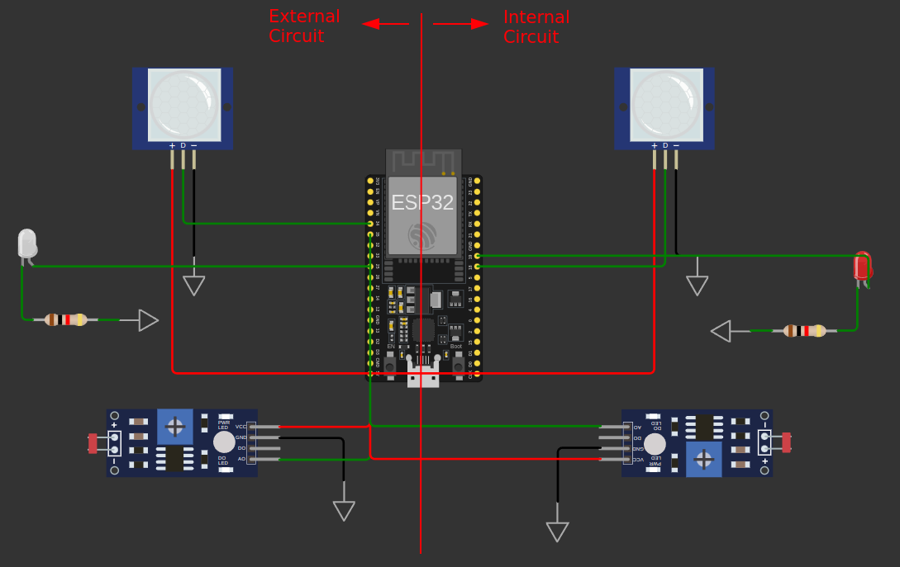

### Diagrama de Circuito para Otimização de Iluminação Residencial

O diagrama Wokwi descreve um circuito que simula a otimização da iluminação interna e externa de uma residência utilizando sensores LDR (Fotoresistor) e PIR (Sensor de Movimento) com o microcontrolador ESP32. A solução considera a luminosidade e o movimento para acionar os LEDs e garantir que a iluminação externa nunca fique totalmente apagada durante a noite, visando segurança.

### Funções dos Componentes:

#### Ambiente Externo
- **LDR Externo (LDR1)**: Mede a luminosidade externa e determina se está noite ou dia, utilizando a resistência do LDR.
- **Sensor PIR Externo (PIR1)**: Detecta movimentos externos e ativa a iluminação quando há movimento durante a noite.
- **LED Externo (LED1)**: Representa a iluminação externa, que pode ser acesa durante a noite ou quando há movimento.

#### Ambiente Interno
- **LDR Interno (LDR2)**: Mede a luminosidade interna, ativando as luzes internas quando a luz ambiente for insuficiente.
- **Sensor PIR Interno (PIR2)**: Detecta movimento interno e aciona a iluminação interna.
- **LED Interno (LED2)**: Representa a iluminação interna, que é ajustada conforme a luminosidade e o movimento detectado.

### Conexões dos Componentes:

#### Ambiente Externo:
1. **LDR Externo (LDR1)**:
   - **VCC** → **5V** do ESP32
   - **GND** → **GND** do ESP32
   - **AO (Saída Analógica)** → **Pino 12** do ESP32

2. **Sensor PIR Externo (PIR1)**:
   - **VCC** → **5V** do ESP32
   - **GND** → **GND** do ESP32
   - **OUT** → **Pino 34** do ESP32

3. **LED Externo (LED1)**:
   - **A** → **Pino 25** do ESP32
   - **C** → **Resistor de 1kΩ (R1)** → **GND**

#### Ambiente Interno:
1. **LDR Interno (LDR2)**:
   - **VCC** → **5V** do ESP32
   - **GND** → **GND** do ESP32
   - **AO (Saída Analógica)** → **Pino 35** do ESP32

2. **Sensor PIR Interno (PIR2)**:
   - **VCC** → **5V** do ESP32
   - **GND** → **GND** do ESP32
   - **OUT** → **Pino 18** do ESP32

3. **LED Interno (LED2)**:
   - **A** → **Pino 19** do ESP32
   - **C** → **Resistor de 1kΩ (R2)** → **GND**

### Funcionamento:

1. **Ambiente Externo**:
   - O LDR externo detecta a luminosidade e, se estiver abaixo de um determinado limiar, o sistema considera que é noite.
   - O sensor PIR externo detecta movimento. Se houver movimento e estiver à noite, o LED externo será acionado.
   - Se não houver movimento, o LED externo permanece aceso por 30 segundos e depois diminui a intensidade para garantir segurança, mas sem consumir energia excessiva.

2. **Ambiente Interno**:
   - O LDR interno mede a luminosidade e, se a luz estiver abaixo de um limiar, o sistema acende as luzes internas.
   - O sensor PIR interno detecta movimento. Se houver movimento e a luminosidade estiver baixa, o LED interno será aceso.
   - Caso contrário, o LED interno é apagado para economizar energia.

### Código de Controle:

O código realiza a leitura da luminosidade e do movimento em ambos os ambientes e controla os LEDs de acordo com a detecção de luz e movimento. No ambiente externo, as luzes permanecem acesas por um período após o movimento ser detectado, enquanto no ambiente interno, as luzes são ajustadas conforme a necessidade de iluminação.

Esse diagrama e descrição formam um sistema que não apenas otimiza a iluminação, mas também oferece segurança ao garantir que a iluminação externa não seja desligada completamente durante a noite.

