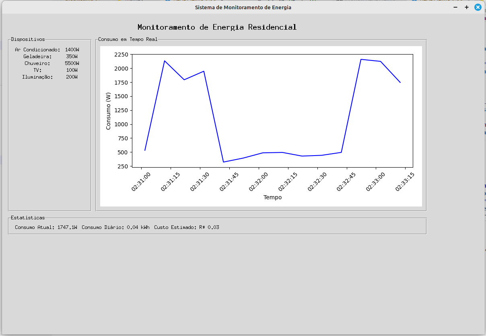

# Sistema de Monitoramento de Energia Residencial

## Introdução

Este projeto foi desenvolvido como parte da atividade **Global Solutions (GS) 2024.2**, cujo tema é **Energia**. A solução utiliza **Data Science**, **IoT**, **Python** e **Banco de Dados** para otimizar o consumo de energia em ambientes residenciais, com foco na eficiência energética, sustentabilidade e redução de custos.

A aplicação apresentada oferece uma interface gráfica para monitoramento e gerenciamento do consumo energético, integrando dispositivos residenciais e simulando dados em tempo real.  **Os dados de consumo simulados são gravados em um banco de dados PostgreSQL.  Esses dados serão utilizados na integração completa do sistema na seção "Ir Além", conectando o sistema de monitoramento com outras partes do projeto (AICSS, CDS, SCR).** A ideia é proporcionar uma base funcional que pode ser expandida para incluir recursos avançados, como integração com fontes renováveis (solar, eólica) e análise preditiva.

---

## Objetivos

- **Monitorar o consumo energético em tempo real:** Simular dispositivos e seu impacto no consumo total.
- **Promover eficiência energética:** Apresentar dados que ajudam o usuário a identificar padrões e reduzir custos.
- **Fornecer uma base escalável:** Preparar o sistema para integração com banco de dados e fontes renováveis.
- **Estimar custos de energia:** Calcular o custo com base no consumo diário e na tarifa energética.
- **Gravar dados em banco de dados:** Armazenar os dados de consumo para posterior análise e integração com outros módulos do projeto.

---

## Funcionalidades do Sistema

### 1. Interface Gráfica
- Desenvolvida com **Tkinter**, apresentando um painel principal dividido em:
  - **Dispositivos:** Lista de dispositivos com status, potência e consumo.
  - **Gráficos:** Exibição do consumo energético em tempo real.
  - **Estatísticas:** Dados de consumo atual, diário e custo estimado.

### 2. Monitoramento em Tempo Real
- Atualizações automáticas a cada 10 segundos.
- Consumo de dispositivos simulados com variações aleatórias para refletir condições reais.

### 3. Gráficos Interativos
- Exibição do histórico de consumo com timestamps.
- Representação visual clara e intuitiva para análise do usuário.

### 4. Estatísticas de Consumo e Custo
- Consumo atual em watts (W).
- Consumo diário estimado em kilowatt-hora (kWh).
- Cálculo do custo com base na tarifa simulada (R$ 0,75/kWh).

### 5. (Opcional) Integração com Banco de Dados PostgreSQL
- Os dados de consumo de cada dispositivo, incluindo timestamp, potência (kW), frequência de atualização (em segundos), nome do dispositivo e status (ligado/desligado) são gravados no banco de dados.

---

## Detalhamento Técnico

### Tecnologias Utilizadas
- **Python 3.9+**
- **Tkinter:** Criação da interface gráfica.
- **Matplotlib:** Gráficos interativos de consumo.
- **Pandas:** Manipulação e análise de dados (possível expansão futura).
- **Random:** Simulação de dados para dispositivos.
- **psycopg2:** Conexão com o banco de dados PostgreSQL.

### Estrutura do Código
1. **Classe Principal (`EnergyMonitorSystem`):**
   - Gerencia dispositivos, consumo e atualização dos dados.
   - Responsável pela interface gráfica e integração dos componentes.
   - Inclui métodos para conectar ao banco de dados, salvar e recuperar dados.
2. **Simulação de Consumo:**
   - Estima o consumo de dispositivos com base no status atual (ligado/desligado) e uma variação aleatória.
3. **Atualização Automática:**
   - Usa `root.after()` para atualizar os dados e gráficos em intervalos regulares.
4. **(Opcional) Conexão e Gravação de Dados:**
    - Usa a biblioteca `psycopg2` para conectar a um banco de dados PostgreSQL e gravar os dados de consumo.  A função `save_consumption_data()` realiza a gravação, utilizando transações para garantir a integridade dos dados.


---

## Utilidade Prática

- **Residências:** Monitoramento detalhado do consumo energético e identificação de dispositivos com alto consumo.
- **Educação:** Demonstração de conceitos de IoT e otimização energética para estudantes e profissionais.
- **Base para Projetos Avançados:** Escalável para integração com fontes renováveis, banco de dados e dispositivos reais.

---

## Possibilidades de Expansão

### 1. Integração com Banco de Dados (Já implementada)
- Armazenar histórico de consumo para análises futuras.
- Salvar configurações personalizadas de dispositivos.

### 2. Fontes de Energia Renovável
- Monitorar geração solar e eólica.
- Selecionar automaticamente a fonte mais econômica e sustentável.

### 3. Análise Preditiva
- Usar algoritmos de machine learning para prever padrões de consumo.
- Detectar anomalias e sugerir ações corretivas.

### 4. Relatórios e Notificações
- Gerar relatórios em PDF com estatísticas detalhadas.
- Enviar notificações em tempo real (e-mail ou push).

### 5. Controle Automático
- Ativar/desativar dispositivos automaticamente com base em regras predefinidas (ex.: horários de pico).

---

## Como Usar

1. **Pré-requisitos:**
   - Python 3.9+ instalado.
   - Bibliotecas necessárias: `tkinter`, `matplotlib`, `pandas`, `psycopg2-binary`.  Instale com: `pip install tkinter matplotlib pandas psycopg2-binary`
   - PostgreSQL instalado e configurado.  Um usuário e banco de dados devem ser criados (`fiap_gs` e `gs_energia_residencial`, respectivamente), com as permissões descritas na seção "Configuração do Banco de Dados".
   - Execute os comandos SQL para criação de tabela e concessão de permissões descritos na seção "Configuração do Banco de Dados".

2. **(Opcional) Configuração do Banco de Dados:**
    - O script SQL necessário para a criaçao de usuário, banco de dados e tabela está presente no diretório `src/CTWP/script/initialize_db.sql`.
    - Crie um usuário e um banco de dados no PostgreSQL:
       ```sql
       CREATE USER fiap_gs WITH PASSWORD 'fiap_gs';
       CREATE DATABASE gs_energia_residencial OWNER fiap_gs;
       \c gs_energia_residencial fiap_gs
       GRANT ALL PRIVILEGES ON DATABASE gs_energia_residencial TO fiap_gs;
       GRANT ALL PRIVILEGES ON ALL TABLES IN SCHEMA public TO fiap_gs;
       GRANT USAGE, SELECT, UPDATE ON ALL SEQUENCES IN SCHEMA public TO fiap_gs;
       ```
    - Execute o código SQL acima para criar usuário, a database `gs_energia_residencial`, a tabela `CONSUMO_RESIDENCIAL` e todos os privilégios necessários.

3. **Execução:**
   - Clone este repositório:
     ```bash
     git clone https://github.com/brunoconterato/fiap_global_solutions_2024
     cd fiap_global_solutions_2024/src/CTWP
     ```
   - Execute o script principal:
     ```bash
     python main.py
     ```
   - (Opcional) Substitua os valores das credenciais de conexão com o banco de dados PostgreSQL.

4. **Interface:**
   - Visualize os dispositivos e seu status.
   - Acompanhe o consumo em tempo real no gráfico.
   - Consulte as estatísticas de consumo e custo estimado.

---

## Conclusão

Este projeto é um ponto de partida para o desenvolvimento de sistemas inteligentes de monitoramento energético. Ele combina conceitos de programação, ciência de dados e IoT, com foco na sustentabilidade e eficiência energética. A solução pode ser personalizada e expandida conforme as necessidades específicas de diferentes cenários residenciais, comerciais ou urbanos.

## Apêndices

### A. Imagem da Interface Gráfica



### B. Código-fonte

```python
import tkinter as tk
from tkinter import ttk
import random
from datetime import datetime, timedelta
import matplotlib.pyplot as plt
from matplotlib.backends.backend_tkagg import FigureCanvasTkAgg
import pandas as pd
import psycopg2

class EnergyMonitorSystem:
    def __init__(self, root, db_host, db_port, db_name, db_user, db_password):
        self.initialize_db(db_host, db_port, db_name, db_user, db_password)
        
        self.root = root
        self.root.title("Sistema de Monitoramento de Energia")
        self.root.geometry("1200x800")
        
        # Dados simulados
        self.devices = {
            "Ar Condicionado": {"power": 1400, "status": "OFF"},
            "Geladeira": {"power": 350, "status": "ON"},
            "Chuveiro": {"power": 5500, "status": "OFF"},
            "TV": {"power": 100, "status": "OFF"},
            "Iluminação": {"power": 200, "status": "ON"}
        }
        
        self.current_consumption = 0
        self.consumption_history = []
        self.timestamps = []
        
        self.setup_gui()
        self.update_data()

    def setup_gui(self):
        # Frame principal
        main_frame = ttk.Frame(self.root, padding="10")
        main_frame.grid(row=0, column=0, sticky=(tk.W, tk.E, tk.N, tk.S))

        # Título
        title = ttk.Label(main_frame, text="Monitoramento de Energia Residencial", 
                         font=('Helvetica', 16, 'bold'))
        title.grid(row=0, column=0, columnspan=2, pady=10)

        # Frame esquerdo - Dispositivos
        devices_frame = ttk.LabelFrame(main_frame, text="Dispositivos", padding="10")
        devices_frame.grid(row=1, column=0, padx=5, pady=5, sticky=(tk.W, tk.E, tk.N, tk.S))

        # Lista de dispositivos
        for i, (device, info) in enumerate(self.devices.items()):
            ttk.Label(devices_frame, text=f"{device}:").grid(row=i, column=0, padx=5, pady=2)
            ttk.Label(devices_frame, text=f"{info['power']}W").grid(row=i, column=1, padx=5, pady=2)
            status_var = tk.StringVar(value=info['status'])
            ttk.Label(devices_frame, textvariable=status_var).grid(row=i, column=2, padx=5, pady=2)

        # Frame direito - Gráficos
        graph_frame = ttk.LabelFrame(main_frame, text="Consumo em Tempo Real", padding="10")
        graph_frame.grid(row=1, column=1, padx=5, pady=5, sticky=(tk.W, tk.E, tk.N, tk.S))

        # Criar figura do matplotlib
        self.fig, self.ax = plt.subplots(figsize=(8, 4))
        self.canvas = FigureCanvasTkAgg(self.fig, master=graph_frame)
        self.canvas.get_tk_widget().pack(fill=tk.BOTH, expand=True)

        # Frame inferior - Estatísticas
        stats_frame = ttk.LabelFrame(main_frame, text="Estatísticas", padding="10")
        stats_frame.grid(row=2, column=0, columnspan=2, padx=5, pady=5, sticky=(tk.W, tk.E))

        # Labels para estatísticas
        self.current_power_var = tk.StringVar(value="Consumo Atual: 0W")
        self.daily_consumption_var = tk.StringVar(value="Consumo Diário: 0 kWh")
        self.cost_var = tk.StringVar(value="Custo Estimado: R$ 0,00")

        ttk.Label(stats_frame, textvariable=self.current_power_var).grid(row=0, column=0, padx=5)
        ttk.Label(stats_frame, textvariable=self.daily_consumption_var).grid(row=0, column=1, padx=5)
        ttk.Label(stats_frame, textvariable=self.cost_var).grid(row=0, column=2, padx=5)

    def simulate_consumption(self):
        """Simula o consumo de energia dos dispositivos"""
        total = 0
        for device, info in self.devices.items():
            if info['status'] == 'ON':
                # Adiciona alguma variação aleatória
                variation = random.uniform(0.8, 1.2)
                total += info['power'] * variation
        return total

    def update_data(self):
        """Atualiza os dados e gráficos"""
        # Simular novo consumo
        self.current_consumption = self.simulate_consumption()
        self.consumption_history.append(self.current_consumption)
        self.timestamps.append(datetime.now())

        # Manter apenas os últimos 60 pontos (10 minutos)
        if len(self.consumption_history) > 60:
            self.consumption_history.pop(0)
            self.timestamps.pop(0)
            
        self.save_consumption_data() #Salva os dados no banco de dados.

        # Atualizar gráfico
        self.ax.clear()
        self.ax.plot(self.timestamps, self.consumption_history, 'b-')
        self.ax.set_xlabel('Tempo')
        self.ax.set_ylabel('Consumo (W)')
        self.ax.tick_params(axis='x', rotation=45)
        self.fig.tight_layout()
        self.canvas.draw()

        # Atualizar estatísticas
        self.current_power_var.set(f"Consumo Atual: {self.current_consumption:.1f}W")
        daily_kwh = sum(self.consumption_history) * 10 / (3600 * 1000)  # convertendo para kWh
        self.daily_consumption_var.set(f"Consumo Diário: {daily_kwh:.2f} kWh")
        cost = daily_kwh * 0.75  # Considerando tarifa de R$ 0,75 por kWh
        self.cost_var.set(f"Custo Estimado: R$ {cost:.2f}")

        # Simular mudança aleatória no status dos dispositivos
        for device in self.devices:
            if random.random() < 0.1:  # 10% de chance de mudar o status
                self.devices[device]['status'] = 'ON' if random.random() < 0.5 else 'OFF'

        # Agendar próxima atualização
        self.root.after(10000, self.update_data)  # Atualiza a cada 10 segundos
        
    def initialize_db(self, db_host, db_port, db_name, db_user, db_password):
        self.db_host = db_host
        self.db_port = db_port
        self.db_name = db_name
        self.db_user = db_user
        self.db_password = db_password
        self.conn = None
        self.cur = None
        self.connect_to_db()
        
    def connect_to_db(self):
        try:
            self.conn = psycopg2.connect(host=self.db_host, database=self.db_name, user=self.db_user, password=self.db_password, port=self.db_port)
            self.cur = self.conn.cursor()
            print("Conectado ao banco de dados PostgreSQL")
        except psycopg2.Error as e:
            print(f"Erro ao conectar ao banco de dados: {e}")
            
    def close_db_connection(self):
        if self.conn:
            self.cur.close()
            self.conn.close()
            print("Conexão com o banco de dados fechada")
    
    def save_consumption_data(self):
        try:
            self.cur.execute("BEGIN;") # inicia uma transação
            for device, info in self.devices.items():
                consumo_kw = info['power'] / 1000 if info['status'] == 'ON' else 0
                try:
                    self.cur.execute("""
                        INSERT INTO CONSUMO_RESIDENCIAL (timestamp, consumo_potencia_kw, frequencia_atualizacao_s, dispositivo, status)
                        VALUES (%s, %s, %s, %s, %s)
                    """, (datetime.now(), consumo_kw, 10, device, info['status']))
                except psycopg2.IntegrityError as e:  #captura erro de chave única
                    if 'unique constraint' in str(e).lower():
                        print(f"Aviso: Tentativa de inserção duplicada ignorada para {device}.")
                    else:
                        raise e #relança outras exceções

            self.conn.commit() #commit da transação inteira, caso tudo tenha dado certo
            print("Dados de consumo salvos no banco de dados.")

        except psycopg2.Error as e:
            print(f"Erro ao salvar dados no banco de dados: {e}")
            self.conn.rollback() #Rollback caso ocorra algum erro, mantendo a consistência
        except Exception as e:
            self.conn.rollback()
            print(f"Erro genérico: {e}")

if __name__ == "__main__":
    root = tk.Tk()
    
    #Credenciais do seu banco de dados
    db_host = "localhost" #ou seu IP
    db_port = "5432"
    db_name = "gs_energia_residencial"
    db_user = "fiap_gs"
    db_password = "fiap_gs"
    
    app = EnergyMonitorSystem(root, db_host, db_port, db_name, db_user, db_password)
    root.mainloop()
```